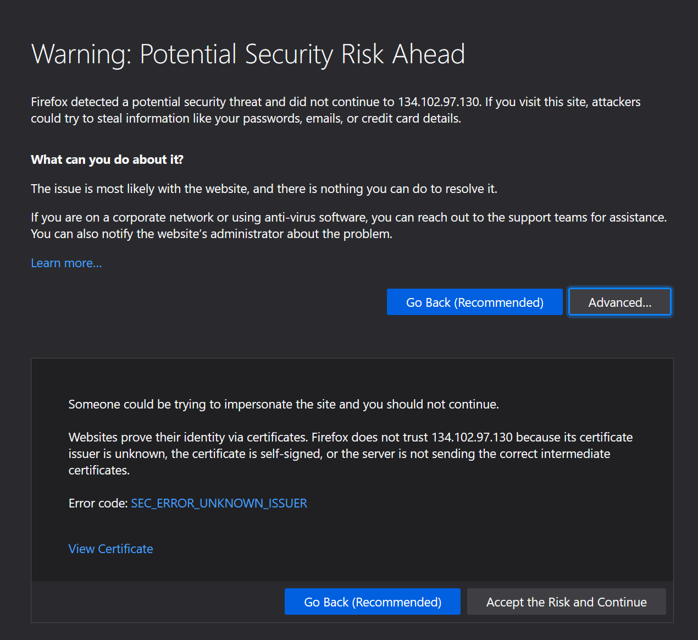
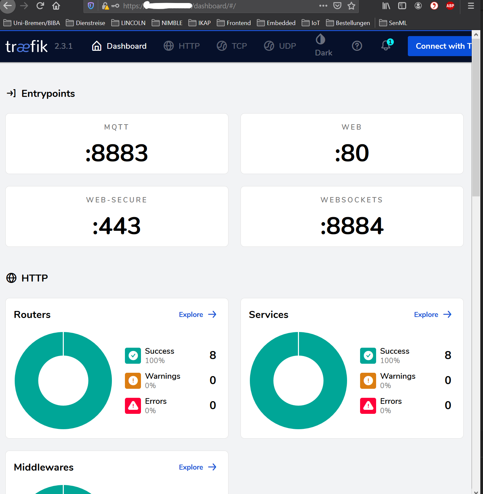
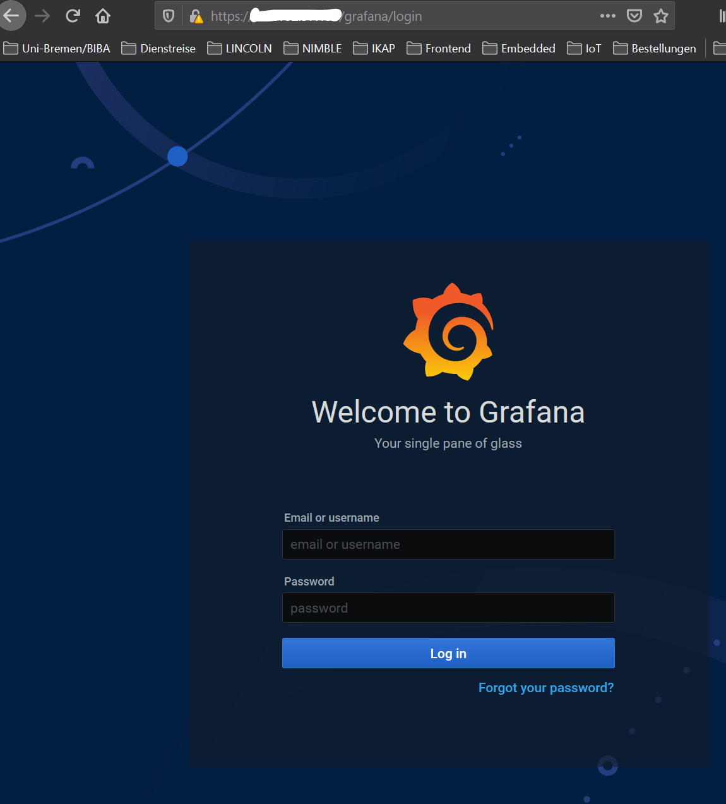
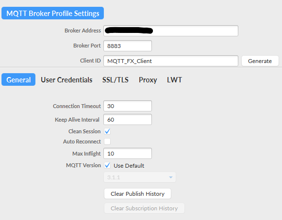
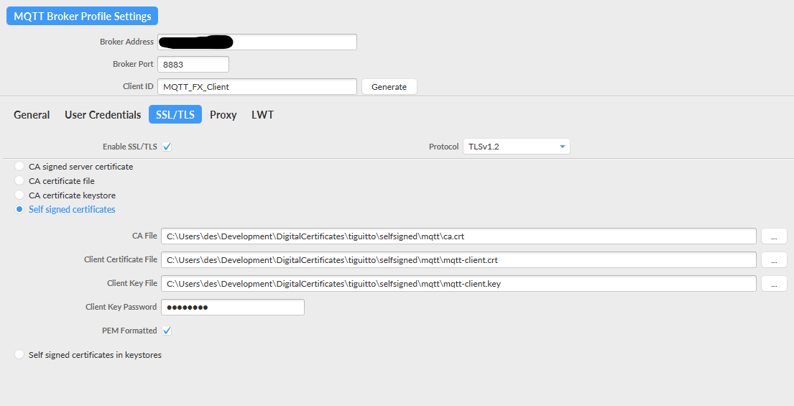

# TIGUITTO Self-Signed Case

The __Self-Signed__ Case generates necessary Certificates in order to provide __TLS__ Security for components. This case
adds upon the __Prototype__ Case by adding more security in addition to basic authentication.

## Environment Variables & Configuration Files

### Authentication

- Use the `selfsigned.env` file to change the default username and passwords for the stack components.
- Additionally, InfluxDB will be up with HTTPS

### Telegraf

- Adapt the `topics`, `database` in the `telegraf/telegraf.conf` according to requirements
- Optionally add / remove the `[[processors.regex]]` logic from the `telegraf.conf` file
- Additionally, `insecure_skip_verify` is set to true since we use Self-Signed Certificates

### Mosquitto

- if you wish to change the usernames/passwords for publishing and subscribing clients edit the `mosquitto/config/passwd` file. The
format of the file is as follows:

        username1:password1
        username2:password2

### Self-Signed Certificates

The bash script `generate-certs.sh` uses `openssl` to generate:
1. __Certificate Authority (CA)__ key and certificate
2. keys and certificates for InfluxDB, Mosquitto, Mosquitto Clients for Publishing

This requires subjects which has some hard-coded information in the script.

Feel Free to change the `SUBJECT_*` variables' geographical and organizational values in `generate-certs.sh`.

> __NOTE__: _CHANGE_ the `CN` value to your Server's Domain Name if it has one, if not currently it uses the Host IP address using `hostname -I`

## Steps to Bring the Stack Up

1. Create a network for your stack:

        docker network create iotstack

2. Encrypting the Passwords for Mosquitto Broker:
    ```bash
        cd selfsigned/
        docker run -it --rm -v $(pwd)/mosquitto/config:/mosquitto/config eclipse-mosquitto mosquitto_passwd -U /mosquitto/config/passwd
    ```

    If there is no response from the command, the passwords are encrypted. You can see the encrypted passwords using:

        cat mosquitto/config/passwd

3. Generate Self-Signed Certificates using the script:

        chmod +x generate-certs.sh
        ./generate-certs.sh
    
    a. During initial Creation for __CA__, you will be asked to enter __PEM Passphrase__. You can keep it whatever you want, but you will need it everytime you create a new certificate. For simplicity use __tiguitto__.

    b. This should create the following certificates and keys in the `certs` folder:

                certs/
                ├── ca.crt
                ├── ca.key
                ├── ca.srl
                ├── domain.crt
                ├── domain.csr
                ├── domain.key
                ├── grafana
                │   ├── ca.crt
                │   ├── grafana-server.crt
                │   ├── grafana-server.csr
                │   └── grafana-server.key
                ├── influxdb
                │   ├── ca.crt
                │   ├── influx-server.crt
                │   ├── influx-server.csr
                │   └── influx-server.key
                └── mqtt
                    ├── ca.crt
                    ├── mqtt-client.crt
                    ├── mqtt-client.csr
                    ├── mqtt-client.key
                    ├── mqtt-server.crt
                    ├── mqtt-server.csr
                    ├── mqtt-server.key

        NOTE: We copy the `ca.crt` in each component directory in order to keep the mount volumes in the compose file simple.

4. Distribute `mqtt-client.crt` and `mqtt-client.key` to the Sensor Nodes that need to publish information when `require_certificates` is set to `true` in Mosquitto Configuration File

5. change the Ownership for the Grafana Server Certificates using:

    ```bash
        sudo chown -R 472:472 certs/grafana/
    ```

6. Bring the Stack up:

        USER_ID="$(id -u)" GRP_ID="$(id -g)" docker-compose -f docker-compose.selfsigned.yml up
    
    add `-d` flag to detach the stack logs

7. For your MQTT Clients copy the `ca.crt`, `mqtt-client.crt`, and `mqtt-client.key` and add them to your Apps accordingly.


## Component Availability behind Reverse-Proxy

|   Component  |  Credentials (username:password)  |                         Endpoint                         |
|:---------:|:-----------------:|:-----------------------------------------------------------------------------------------------------:|
| `traefik` | `admin:tiguitto`  | `curl -i --insecure -u admin:tiguitto https://localhost/dashboard/`<br> Browser: `https://<IP_ADDRESS>/dashboard/` |
| `grafana` | `admin:tiguitto`  | `curl -i --insecure -u admin:tiguitto https://localhost/grafana/api/health`<br> Browser: `https://<IP_ADDRESS>/grafana`       |
| `influxdb`| `tiguitto:tiguitto` | `curl -i --insecure -u tiguitto:tiguitto https://localhost/influxdb/ping` |
| `mosquitto` | `{sub,pub}client:tiguitto` | Use an MQTT Client here         |
    
    NOTE: use the `--insecure` parameter when querying self-signed certificate server


## Publishing with MQTT Clients

You will require all devices or Apps that will publish data to the TIGUITTO Broker to have the `ca.crt` on them along with the user `pubclient`. The certificate will enable SSL/TLS and the authentication will only allow dedicated devices to publish data to the Broker.

### Typical MQTT Client Configuration

| Conf | Value        |
|------|--------------|
| Host | <IP_Address> |
| Port | 8883         |
| User | `pubclient`  |
| TLS  | `v1.2`       |
| Pass | `tiguitto`   |
| cert | `ca.crt`, `mqtt-client.crt`, `mqtt-client.key`     |


## Mosquitto Websocket Client using Paho-MQTT-Python With Certificates

- if `mosquitto.conf` has `require_certificates true` then the following code will work:

<details>

```python
import ssl
import sys
import paho.mqtt.client as mqtt


BROKER = '<IP_ADDRESS_BROKER>'
PORT = 8884

CA_CERT_FILE = 'path/to/selfsigned/ca.crt'
CERT_FILE = 'path/to/selfsigned/mqtt-client.crt'
KEY_FILE = 'path/to/selfsigned/mqtt-client.key'
TOPIC = 'IOT/#'

def on_connect(mqttc, obj, flags, rc):
    print("rc: "+str(rc))

def on_message(mqttc, obj, msg):
    print(msg.topic+" "+str(msg.qos)+" "+str(msg.payload))

def on_publish(mqttc, obj, mid):
    print("mid: "+str(mid))

def on_subscribe(mqttc, obj, mid, granted_qos):
    print("Subscribed: "+str(mid)+" "+str(granted_qos))

def on_log(mqttc, obj, level, string):
    print(string)


# Create Client with Websockets transport
mqttc = mqtt.Client('tiguitto-selfsigned-ws', transport='websockets')

mqttc.tls_set(ca_certs=CA_CERT_FILE,certfile=CERT_FILE,keyfile=KEY_FILE,tls_version=ssl.PROTOCOL_TLSv1_2)
mqttc.tls_insecure_set(True) # for Self-Signed Certificates


mqttc.on_message = on_message
mqttc.on_connect = on_connect
mqttc.on_publish = on_publish
mqttc.on_subscribe = on_subscribe
# Uncomment to enable debug messages
mqttc.on_log = on_log
mqttc.connect(BROKER, PORT, 60)
mqttc.subscribe(TOPIC, 0)


try:
    mqttc.loop_forever()
except KeyboardInterrupt as e:
    print('CTRL+C Pressed')
    mqttc.loop_stop()
    mqttc.disconnect()
    sys.exit()

```

</details>

# Snapshots

- Initial TLS Information since we are use a self-signed Certificate : `<IP_ADDRESS>/dashboard/`

    

  Click on __Accept the Risk and Continue__ and we reroute to `https://<IP_ADDRESS>/dashboard/#/` for the Traefik Dashboard.

  Username and Password for Traefik Dashboard are `admin` & `tiguitto` respectively

- Traefik Dashboard: `https://<IP_ADDRESS>/dashboard/ with credentials:

    

- Grafana Dashboard: `https://<IP_ADDRESS>/grafana`

    

- MQTT Client (using [MQTT.fx](https://mqttfx.org)) Settings to connect to Broker: `ssl://<IP_address>:8883`

    

- MQTT Client SSL/TLS Settings if Certificates are Required by Broker:

    
